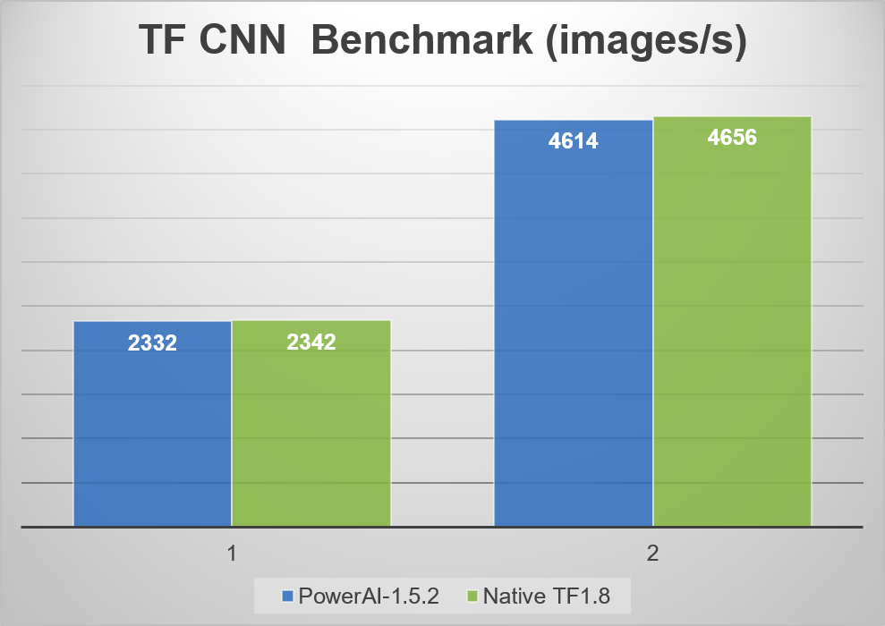
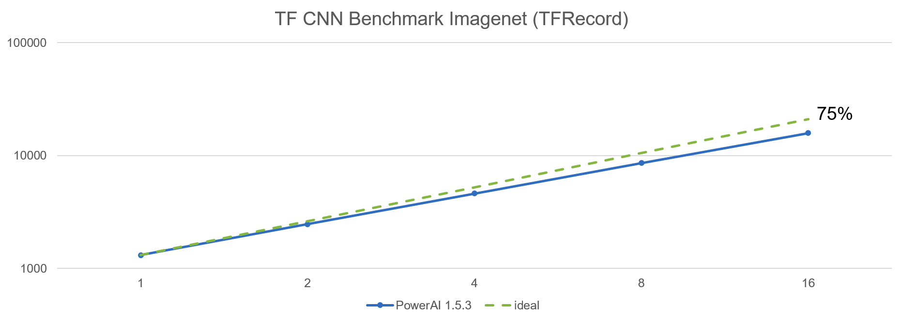
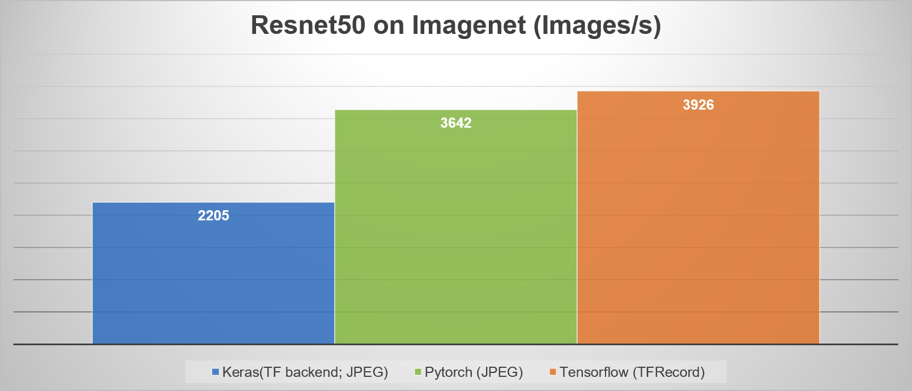
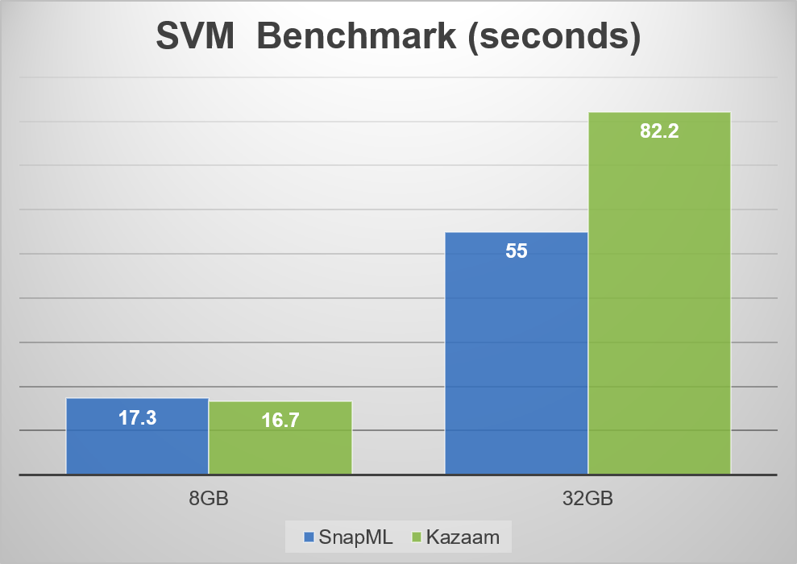
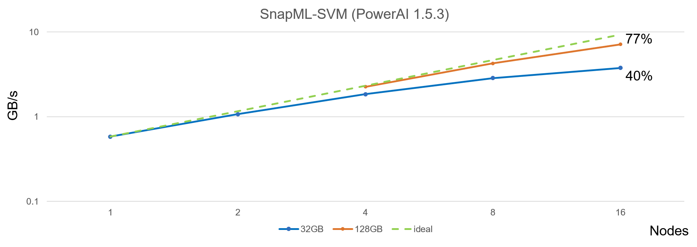

# PowerAI on Summit
[PowerAI](https://developer.ibm.com/linuxonpower/deep-learning-powerai/) is 
IBM's software distribution with the most popular open frameworks such as 
Tensorflow, Pytorch, Caffe, and its own proprietary ML/DL libraries such as DDL,
SnapML. Some of the latest (1.5.3) offerings are

| Framework    | Version  | 
| ------------ | -------  |
| Tensorflow   | 1.10.0   |
| Pytorch      | 0.4.1    |
| Snap ML      | 1.0.0    |  

The main limiations for the freely avaiable PowerAI is 1. it works only 
on Power hardware. 2. DDL is scaled up to 4 nodes (PowerAI Enterprise is 
required to scale beyond 4 ndoes). To get around the DDL limiation, the 
installation of Horovod is necessary. 

## Deployment of PowerAI container
### Building a PowerAI Singularity Image from an IBM Docker Image

IBM's PowerAI product is distributed in Docker format, via DockerHub, to Docker users. Since we don't run Docker, we'll use the Singularity binary to convert and build this source into a Singularity formatted (*.simg) container image. If we decide to make PowerAI a container solution for the OLCF's scientific users, this is something that UA would need to do for each new PowerAI release.

  *  We'll do this with the --writable option so we have write abilities inside the container when root.

  *  As root (via sudo) we'll shell into the container (also with the --writable option) and update the license acceptance.

  *  The resulting Singularity image will be read-only to end-users, but contain all of the pre-installed software provided in the PowerAI product, licenses accepted.

  * There are (2) reasons we need root to do this.
    - Sudo is required to build a writable (persisting changes) Singularity image.
    - The status.dat file we'll need to update in the container is root-owned.

1. From a Power architecture system, build a writable file sourced from IBM's DockerHub.
   (sudo required for --writable flag)

    ```
    host$ sudo singularity build --writable <my_singularity_image.simg> <source>
    ```

    For example:
    ```
    host$ sudo singularity build --writable powerai-1.5.3-all-ubuntu16.04.simg docker://ibmcom/powerai:1.5.3-all-ubuntu16.04
    ```

2. Use sudo to shell into the resulting Singularity image, indicating the --writable option.

    ```
    host$ sudo singularity shell --writable <my_singularity_image.simg>
    ```

3. Clear the license acceptance messages.

    ```
    container$ echo "Status=9" >> /opt/DL/license/lap_se/license/status.dat
    ```

4. Exit. You've just created a PowerAI container image ready for end-users.

    ```
    container$ exit
    ```
### Install addiational packages 
A user can install any software packages on top of a existing image. To install
horovod, 
```python
module load cuda
singularity shell --nv /path/to/the/image
export PATH=/opt/anaconda2/bin:$PATH
. /opt/DL/mldl-spectrum/bin/mldl-spectrum-activate
. /opt/DL/tensorflow/bin/tensorflow-activate
. /opt/DL/pytorch/bin/pytorch-activate
export CPATH=$CUDA_DIR/targets/ppc64le-linux/include:$CPATH
HOROVOD_WITH_PYTORCH=1 HOROVOD_GPU_ALLREDUCE=NCCL HOROVOD_NCCL_HOME=/usr/lib/powerpc64le-linux-gnu/ 
pip install --install-option="--prefix=/path/to/user/space" horovod
```
and add the installation path to PYTHONPATH when use it. 

### Workaround the MPI issue
The Spectrum MPI pre-installed in PowerAI doesn't come with Infiniband support. To use the Spectrum MPI module on Summit, certain libraires need to be added to the container via SINGULARITY_CONTAINLIBS, and libpami_cudahook.so needs to be preloaded to make the default pami layer work correctly. Following is the script to add those 2 environment vairables. 
```bash
#!/usr/bin/env bash

mpilibs=("/opt/ibm/spectrum_mpi/lib" \
         "/opt/ibm/spectrum_mpi/lib/spectrum_mpi" \
         "/opt/ibm/spectrum_mpi/jsm_pmix/lib" \
         "/opt/ibm/spectrum_mpi/lib/pami_port" \
         "/opt/mellanox/hcoll/lib" \
         "/opt/mellanox/sharp/lib" \
         "/opt/mellanox/mxm/lib")
deplibs=("libucp.so" "libuct.so" "libucs.so" \
         "libucm.so" "libnl-route-3.so" \
         "librdmacm.so" "libibumad.so" \
         "libibverbs.so" "libosmcomp.so" \
         "libnl-3.so" "librxe-rdmav2.so" \
         "libmlx4-rdmav2.so" "libmlx5-rdmav2.so")

for libs in ${deplibs[@]}; do
  for lib in /usr/lib64/${libs}*; do
     if [ -z "${SINGULARITY_CONTAINLIBS:-}" ]; then
            SINGULARITY_CONTAINLIBS="$lib"
        else
            SINGULARITY_CONTAINLIBS="$SINGULARITY_CONTAINLIBS,$lib"
    fi
  done
done

for libdir in ${mpilibs[@]}; do
  for lib in $libdir/*.so*; do
    if [ -z "${SINGULARITY_CONTAINLIBS:-}" ]; then
            SINGULARITY_CONTAINLIBS="$lib"
        else
            SINGULARITY_CONTAINLIBS="$SINGULARITY_CONTAINLIBS,$lib"
    fi
  done
done

export SINGULARITYENV_LD_PRELOAD=$(readlink -f libpami_cudahook.so)
export SINGULARITY_CONTAINLIBS
export SINGULARITYENV_PREPEND_PATH=/opt/anaconda2/bin
```
libpami_cudahook.so* needs to be copied to a directory visiable to the container(preferably /gpfs or /sw) since /opt is not. Note that DDL requires GPU support for Spectrum MPI, hence extra flag `--smpiargs "-gpu"` is needed. 

### Workaround the SnapML RPATH issue
The libsnapmlmpi2/3.so at /opt/DL/snap-ml-mpi/lib/snap_ml_mpi was linked with RPATH, which picks up Spetrum MPI within the PowerAI even with the above workaround. To bypass this issue, one way is to remove the RPATH within .so following,
```bash
chrpath -d libsnapmlmpi?.so 
```
Note that the chrpath utility is not available on Summit. 

## Usage of ML/DL frameworks in PowerAI
Followings are some of example usages for the Tensorflow, Pytorch, and SnapML within the context of PowerAI singularity container on Summit. For general description, please refer to this [link](https://developer.ibm.com/linuxonpower/deep-learning-powerai/releases/#getting-started-with-mldl-frameworks "Getting Started with MLDL Frameworks")

As noted above, to use PowerAI container, first setup the 3 singularity environment varailbes (`SINGULARITY_CONTAINLIBS`,`SINGULARITYENV_LD_PRELOAD`,`SINGULARITYENV_PREPEND_PATH`).  

### Tensorflow
PowerAI shipped with Tensorflow high performance benchmarks. To install the benchmark locally, do 
```bash
singularity shell --nv /path/to/the/image
./opt/DL/tensorflow-performance-models/bin/tensorflow-install-models . 
```
To run the benchmark, do following in the job script
```bash
cat << EOF > run-benchmark.sh
export PYTHONPATH=/path/to/horovod/lib:$PYTHONPATH
. /opt/DL/tensorflow/bin/tensorflow-activate
python tf_cnn_benchmarks.py --variable_update=horovod --model=resnet50  --num_gpus=1 --batch_size=64 --num_batches=1000
EOF
chmod +x run-benchmark.sh
jsrun -n 1 -a 6 -c 42 -g 6 -r 1 singularity exec --nv /path/to/image ./run-benchmark.sh
```
Preliminary comparison of PowerAI container versus native build on Summit:


Preliminary scaling of Tensorflow with Horovod on Summit for Resnet50 on Imagenet:


### Pytorch 
Bascially, Pytorch can be used similarly as above. Note that the DataLoader seems to have issue with Spectrum MPI, which is not specific to the container. So, for multinode runs, there are 2 options: 1) set the `num_worker=0`; 2) set MPI flag `--smpiargs "-tcp"`, which seems to work fine for multi-dataloaders. There are performance drop in communication, but bulk of communication is still use InfiniBand with NCCL2 via Horovod. Option 1 seems to be preferable for training Resnet50 on Imagenet.  

Preliminary comparisons of Pytorch versus Keras and Tensorflow for Resnet50 on Imagenet (data preloaded to tmpfs) with 4 Summit nodes:


### SnapML 
[SnapML](https://arxiv.org/pdf/1803.06333.pdf) is IBM's proprietary framwork for generalized linear model. It currently supports linear regression, support vector machine, and logistic regression with multi-GPUs and multi-nodes. The Python APIs can be found at /opt/DL/snap_ml_mpi/lib/snap_ml_mpi/. 

Preliminary comparison of SnapML versus Kazaam on SVM with random normal data (500 iterations).


Preliminary scaling of SnapML up to 16 nodes (96 GPUs) on Summit.



### Miscellaneous
#### Tensorboard
The preinstalled Tensorboard in the container can be used to visualize the log files from Tensorflow and Pytorch (after installed tensorboardX). 
```bash
singularity shell --nv /path/to/the/images 
. /opt/DL/tensorboard/bin/tensorboard-activate 
tensorboard --logdir=/path/to/log/dir
```
then open the web browser at localhost:6006. 

#### NVProf 
Profiling tool is not pre-installed in the container. To use the NVProf to analyze the CUDA kernal performance, do following in the job script
```bash
module load cuda
cat << EOF > run-nvprof.sh
export LD_LIBRARY_PATH=$LD_LIBRARY_PATH:$CUDA_DIR/lib64
$CUDA_DIR/bin/nvprof  python file-to-profile.py
EOF
jsrun -n 1 -a 6 -c 42 -g 6 -r 1 singularity exec --nv /path/to/image ./run-nvprof.sh
```

#### Timeline 
Tensorflow's [timeline](https://www.tensorflow.org/performance/performance_guide) can be used to trace the local events and Horovod's [timeline](https://github.com/uber/horovod/blob/master/docs/timeline.md) can be used to trace the communication events the same way as running natively. 
